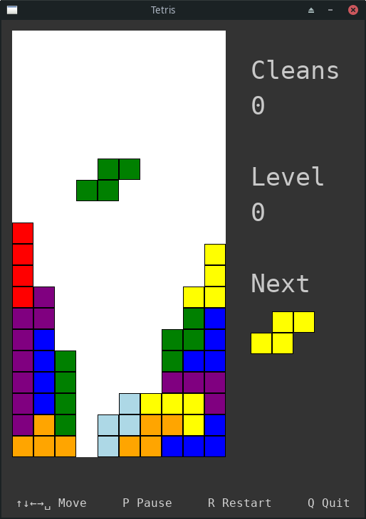

# Tetris

Just another Tetris game written in C and using SDL3.

<p align="center">
  
</p>

## Building on Linux

```
git clone https://github.com/nnosyrev/ctetris.git ctetris
cd ctetris
git submodule init
git submodule update
cmake -S . -B build
cmake --build build
```

## Start playing

```
build/tetris
```
